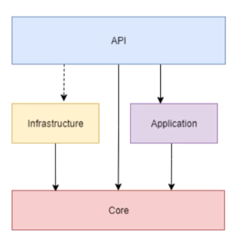

# 🏗️ Arquitetura Limpa

`Clean Architecture`

[`⬆️ inicio`](../../Readme.md)

[`◀️ voltar`](../Readme.md)

---

Também conhecida como `Onion Architecture`, ou `Arquitetura Cebola`, é uma arquitetura amplamente utilizada no mercado .NET.

Tem como foco o domínio do sistema, tendo em sua essência o `Domain-Driven Design` [[+]](./DDD.md).

Tem diversas variações, mas sempre tem a mesma estrutura base.

---

## 🧱 Estrutura

Sua estrutura é dividida em 4 camadas principais, sendo elas:

+ **Core** (também chamada de Domain)
  + Todas as outras camadas giram em torno dela e dependem dela
  + Entidades
  + Enums
  + Interfaces de Repositórios e Serviços
+ **Infrastructure**
  + Responsabilidades de Persistencia de Dados
  + Integração com outros sistemas e serviços, inclusive nuvem, mensageria
+ **Application**
  + Modelo de entrada e saída da aplicação (ViewModels, InputModels, DTOs)
  + Espécie de interface da aplicação
+ **API**/**lnterface**
  + Controllers
  + Configuração do Swagger e outros serviços

## 🫧 Diagrama

---

[`^ topo`](#🏗️-arquitetura-limpa)

