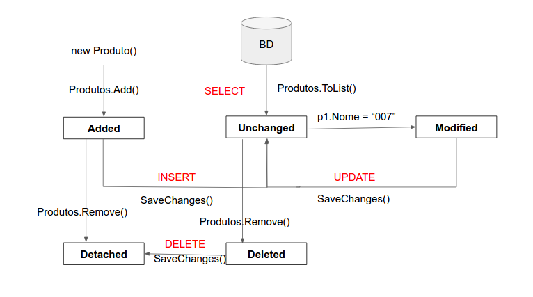

<font face="Calibri">

# ⭐ Entity Framework e SQL

[`⬆️ inicio`](../../README.md)

[`◀️ voltar`](../Readme.md)

---

## Estado do Contexto - ChangeTracker

+ **Added**
  + O objeto é novo, foi adicionado ao contexto, e o método SaveChanges ainda não foi executado. Depois que as mudanças são salvas, o estado do objeto muda para Unchanged. Objetos no estado Added não têm seus valores rastreados em sua instância de EntityEntry.
+ **Unchanged**
  + O objeto não foi modificado desde que foi anexado ao contexto ou desde a última vez que o método SaveChanges foi chamado.
+ **Modified**
  + Uma das propriedades escalares do objeto foi modificada e o método SaveChanges ainda não foi executado. Quando o monitoramento automático de mudanças está desligado, o estado é alterado para Modified apenas quando o método DetectChanges é chamado. Quando as mudanças são salvas, o estado do objeto muda para Unchanged.
+ **Deleted**
  + O objeto foi excluído do contexto. Depois que as mudanças foram salvas, seu estado muda para Detached.
+ **Detached**
  + Desconectado - não está sendo monitorado pelo ChangeTracker)
  + Add > Delete
  + (Unchanged > Remove) = Deleted
    + Deleted > SaveChanges
  + O objeto existe, mas não está sendo monitorado. Uma entidade fica nesse estado imediatamente após ter sido criada e antes de ser adicionada ao contexto. Ela também fica nesse estado depois que foi removida do contexto através do método Detach ou se é carregada por um método com opção NoTracking. Não existem instâncias de EntityEntry associadas a objetos com esse estado.

Exemplo:

```csharp
foreach (var e in context.ChangeTracker.Entries())
{
    Console.WriteLine(e.State); // Estado conforme acima
    Console.WriteLine(e.Entity.ToString()); // Entidade ToString
}
```

Diagrama:


> 🔵 **Informação**
>
> + O Entity guarda um snapshot dos valores dos objetos por padrão.
> + Quando aquele objeto começa a ser monitorado pelo Entity, seja através de métodos que recuperam objetos do banco via SELECT (por exemplo ToList, First, Find, etc.), seja através do método Entry que cria uma entrada no ChangeTracker para o objeto passado como argumento do método.
> + E chama o método DetectChanges ao executar o SaveChanges. O que esse método faz? DetectChanges verifica diferenças entre os valores atuais das propriedades da entidade e os valores originais guardados no snapshot quando ela foi anexada ao contexto.
> + É possível desligar o monitoramento automático de mudanças através de uma propriedade booleana no ChangeTracker chamada AutoDetectChangesEnabled. Quando isso é necessário? Quando você tiver uma gravação massiva de objetos através do SaveChanges, a performance pode sofrer impacto considerável, uma vez que o método DetectChanges será chamado e o ChangeTracker irá percorrer toda a lista de objetos sendo monitorados.

---

## Usando SQL (Raw SQL Queries)

+ Quando o SQL não pode ser expressado por LINQ ou fica ineficiente.
+ Limitações:
  + So pode ser usado para retornar todas as colunas da entidade.
  + Colunas devem ter os seus tipos corretos conforme mapeadas.
  + O Nome das colunas deve seguir oque foi mapeado.
    + A query SQL deve retornar valores para todas as propriedades da entidade.
  + Não pode ter dados relacionados, ou seja só pode trazer os dados daquela entidade específica.
    + Uma query executada pelo FromSql() não pode conter dados relacionados. (SELECT JOINS)

+ Exemplo usando LINQ:

```csharp
var atoresMaisAtuantes = context.Atores
  .Include(a => a.Filmografia)
  .OrderByDescending(a => a.Filmografia.Count)
  .Take(5);
```

+ Exemplo usando FromSQL:

```csharp
var sql = @"select a.*
            from actor a
            inner join
            (select top 5 a.actor_id, count(*) as total
            from actor a
            inner join film_actor fa on fa.actor_id = a.actor_id
            group by a.actor_id
            order by total desc) filmes on filmes.actor_id = a.actor_id";

var atoresMaisAtuantes = context.Atores.FromSql(sql)
    .Include(a => a.Filmografia);
```

*O problema é que devido as limitações especificadas acima é preciso fazer um select diferenciado para se adequar a entidade e incluir separadamente `Include` o Detail, oque acaba gerando um SQL ruim em seguida.*

#### SQL proveniente de Views

+ Garantindo a possibilidade de reutilizar esse SQL, abstraimos para uma View.
+ Considerando que colocamos todo o SQL acima em uma View, esse seria o novo código para executar a mesma ação utilizando a View:

```csharp
var sql = @"select a.* from actor a
            inner join top5_most_starred_actors filmes on filmes.actor_id = a.actor_id";

var atoresMaisAtuantes = context.Atores.FromSql(sql)
    .Include(a => a.Filmografia);
```

## SQL proveniente de Stored Procedures

+ É utilizado o método `context.Database.ExecuteSqlCommand()`.
  + esse comando só serve para executar comandos, não funciona com `select`, apesar de executar, não vai acontecer nada.
  + o método
+ utiliza-se `@` para determinar um parametro que pode ser passado como argumento do método, conforme exemplo abaixo:

```csharp
var categ = "Action"; 
var paramCategoria = new SqlParameter("category_name", categ);

var paramTotal = new SqlParameter
{
    ParameterName = "@total_actors",
    Size = 4,
    Direction = System.Data.ParameterDirection.Output
};

context.Database
    .ExecuteSqlCommand("total_actors_from_given_category @category_name, @total_actors OUT",
    paramCategoria,
    paramTotal);

Console.WriteLine($"O total de atores na categoria {categ} é de {paramTotal.Value}."); // 36
```

+ Esse comando também serve para fazer `INSERT`, `UPDATE` ou `DELETE`:

```csharp
var sql = "INSERT INTO language (name) VALUES ('Teste1'), ('Teste2')";
var registros = context.Database.ExecuteSqlCommand(sql);
Console.WriteLine($"O total de registros afetados é {registros}"); // 2

var deleteSql = "DELETE FROM language WHERE name LIKE 'Teste%'";
registros = context.Database.ExecuteSqlCommand(deleteSql);
Console.WriteLine($"O total de registros afetados é {registros}"); // 2
```

---

[`^ topo`](#⭐-entity-framework-e-sql)
</font>
