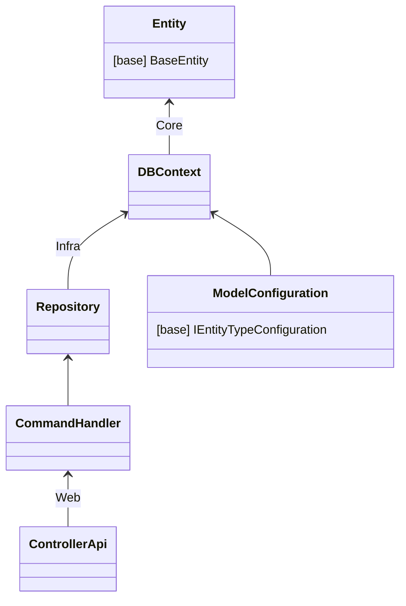

# API CQRS

## Estrutura



---

### Core

#### Entities.Modulo

##### `Entidade.cs`

```csharp
namespace Core.Entities.Modulo
{
    public class Entidade : BaseEntity
    {
        /* Fields */
        public string Examplo { get; set; }

        /* Items List */
        public virtual ICollection<EntidadeItem> EntidadeItens { get; }
    }
}
```

#### Interfaces.Repositories.Modulo

##### `IEntidadeRepository.cs`

```csharp
using Core.Entities.Modulo;
using Core.Helpers;
using System;
using System.Collections.Generic;
using System.Threading.Tasks;

namespace Core.Interfaces.Repositories.Modulo
{
    public interface IEntidadeRepository : IBaseRepository<Entidade>
    {
        Task<IList<Entidade>> Get(IEnumerable<Guid> ids);

        Task<IList<Entidade>> Search(string text, int? take, int? offSet);

        Task<AsyncOutResult<IEnumerable<Entidade>, int>> SearchAll(string text, int? take, int? offSet, string tableFilter, bool? ativos);
    }
}
```

#### Models.Filters.Modulo

##### `GetEntidadeRequestFilter.cs`

```csharp
namespace Core.Models.Filters.Modulo
{
    public class GetEntidadeRequestFilter : BaseRequestFilter
    {
        public string Exemplo { get; set; }
    }
}
```

#### Models.Requests.Modulo

##### `CreateEntidadeRequest.cs`

```csharp
namespace Core.Models.Requests.Modulo
{
    public class CreateEntidadeRequest
    {
        public string Exemplo { get; set; }
    }
}

```

##### `UpdateEntidadeRequest.cs`

```csharp
namespace Core.Models.Requests.Modulo
{
    public class UpdateEntidadeRequest
    {
        public string Exemplo { get; set; }
    }
}

```

##### `DeleteEntidadeRequest.cs`

```csharp
using System;
using System.Collections.Generic;

namespace Core.Models.Requests.Modulo
{
    public class DeleteEntidadeRequest
    {
        public ICollection<Guid> Ids { get; set; }
    }
}
```

#### Models.Responses.Modulo

##### `EntidadeResponse.cs`

```csharp
namespace Core.Models.Responses.Modulo
{
    public class EntidadeResponse
    {
        public string Exemplo { get; set; }
    }
}
```

---

### Infra

#### Data.ModelConfiguration.Modulo

##### `EntidadeModelConfiguration.cs`

```csharp
using Core.Entities.Modulo;
using Microsoft.EntityFrameworkCore;
using Microsoft.EntityFrameworkCore.Metadata.Builders;

namespace Infra.Data.ModelConfiguration.Modulo
{
    public class EntidadeModelConfiguration : IEntityTypeConfiguration<Entidade>
    {
        public void Configure(EntityTypeBuilder<Entidade> entityTypeBuilder)
        {
            entityTypeBuilder.ToTable(nameof(Entidade));

            entityTypeBuilder.Property(e => e.Id).ValueGeneratedNever();

            entityTypeBuilder.Property(e => e.Exemplo)
                .HasMaxLength(100)
                .IsRequired()
                .IsUnicode(false);
        }
    }
}
```

```csharp
using Core.Entities.Modulo;
using Core.Helpers;
using Core.Interfaces.Repositories.Modulo;
using Microsoft.EntityFrameworkCore;
using System;
using System.Collections.Generic;
using System.Linq;
using System.Threading.Tasks;

namespace Infra.Data.Repositories.Modulo
{
    public class EntidadeRepository : BaseRepository<Entidade>, IEntidadeRepository
    {
        private readonly AppDbContext _dbContext;
        private readonly Guid _unidadeAcessoSelecionada;

        public EntidadeRepository(AppDbContext dbContext) : base(dbContext)
        {
            _dbContext = dbContext;
            _unidadeAcessoSelecionada = GetSelectedAccessUnitId();
        }

        public async Task<IList<Entidade>> Get(IEnumerable<Guid> ids)
        {
            var query = _dbContext.Entidade.AsQueryable();

            if (ids != null) query = query.Where(gc => gc.UnidadeAcessoId == _unidadeAcessoSelecionada && ids.Contains(gc.Id));

            return await query.ToListAsync();
        }

        public async Task<IList<Entidade>> Search(string text, int? take, int? offSet)
        {
            var query = _dbContext.Entidade.AsQueryable();
            query = query.Where(gc => gc.UnidadeAcessoId == _unidadeAcessoSelecionada && gc.Nome.Contains(text));

            if (take != null && offSet != null) return await query.Skip((int)offSet).Take((int)take).ToListAsync();
            else return await query.ToListAsync();
        }

        public async Task<AsyncOutResult<IEnumerable<Entidade>, int>> SearchAll(string text, int? take, int? offSet, string tableFilter, bool? ativos)
        {
            IList<KeyValuePair<string, string>> tableFilterList = new List<KeyValuePair<string, string>>();
            int nullOrEmptyFields = 0;
            if (!String.IsNullOrEmpty(tableFilter)) tableFilterList = Newtonsoft.Json.JsonConvert.DeserializeObject<List<KeyValuePair<string, string>>>(tableFilter);

            var query = _dbContext.Entidade.AsQueryable();
            query = query.Where(gc => gc.UnidadeAcessoId == _unidadeAcessoSelecionada);
            query = query.Where(gc => (ativos != null ? gc.Ativo == ativos : gc.Ativo != ativos));

            if (!String.IsNullOrEmpty(text)) query = query.Where(gc => gc.Nome.Contains(text));

            if (tableFilterList.Count > 0)
            {

                foreach (var item in tableFilterList) if (String.IsNullOrEmpty(item.Value)) nullOrEmptyFields++;  
                if (nullOrEmptyFields != tableFilterList.Count)
                {

                    string nomeColuna = tableFilterList.Where(gc => gc.Key.ToUpper() == "NOME").FirstOrDefault().Value;
                    string emailColuna = tableFilterList.Where(gc => gc.Key.ToUpper() == "EMAILS").FirstOrDefault().Value;
                    string icjColuna = tableFilterList.Where(gc => gc.Key.ToUpper() == "ICJ").FirstOrDefault().Value;
                    if (!String.IsNullOrEmpty(nomeColuna))
                        query = query.Where(gc => gc.Nome.ToUpper().Contains(nomeColuna.ToUpper()));
                    if (!String.IsNullOrEmpty(emailColuna))
                        query = query.Where(gc => gc.Emails.ToUpper().Contains(emailColuna.ToUpper()));
                    if (!String.IsNullOrEmpty(icjColuna))
                        query = query.Where(gc => gc.Icj.ToUpper().Contains(icjColuna.ToUpper()));
                }

            }

            int totalCount = await query.CountAsync();

            if (take != null && offSet != null)
                return new AsyncOutResult<IEnumerable<Entidade>, int>(await query.Skip((int)offSet).Take((int)take).ToListAsync(), totalCount);
            else
                return new AsyncOutResult<IEnumerable<Entidade>, int>(await query.ToListAsync(), totalCount);
        }

        public async Task<bool> ExistsNome(string nome)
        {
            return await _dbContext.Entidade.AnyAsync(x => x.UnidadeAcessoId == _unidadeAcessoSelecionada && x.Nome == nome && !x.Deletado);
        }

        public async Task<IList<Guid>> RegistersAreRelated(IEnumerable<Guid> ids)
        {
            IList<Guid> relatedRegisters = new List<Guid>();
            IList<Ocorrencia> ocorrencias = await _dbContext.Ocorrencia.Where(gc => ids.Contains(gc.EntidadeId)).ToListAsync();

            if (ocorrencias != null && ocorrencias?.Count > 0)
            {
                foreach (var item in ocorrencias)
                {
                    if (!relatedRegisters.Contains(item.EntidadeId)) relatedRegisters.Add(item.EntidadeId);
                }
            }

            return relatedRegisters;
        }

        public new async Task<int> CountTable()
        {

            var query = await _dbContext.Entidade.Where(gc => gc.UnidadeAcessoId == _unidadeAcessoSelecionada).CountAsync();
            return query;
        }
    }
}
```

---

### Web
