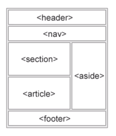

<font face="Calibri">

# 🩻 HTML

[`◀️ voltar`](../Readme.md)
[`⬆️ inicio`](../../Readme.md)

---

`HTML` (abreviação para a expressão inglesa HyperText Markup Language, que significa: 
"Linguagem de Marcação de Hipertexto" é uma linguagem de marcação utilizada na construção de páginas na Web.
(fonte: wikipedia)

## HTML 5

Estrutura básica:

```html
<!DOCTYPE html>
<html lang="en"> <!-- PTBR -->
    <head>
        <meta charset="UTF-8"> 
        <!-- Compatibilidade, IE renderizar equivalente ao Edge -->
        <meta http-equiv="X-UA-Compatible" content="IE=edge">
        <!-- UX de responsividade -->
        <meta name="viewport" content="width=device-width, initial-scale=1.0"> 
        <!-- Nome do site que aparecerá na barra de títulos -->
        <title>Document</title> 
    </head>
    <body>
        
    </body>
</html>
```

> atalho VSCode: `html:5`

---

## Semântica

Exemplo das tags baixo [nesse arquivo](./Exemplos.html).

### Definição

"O HTML semântico tem como objetivo descrever o significado do conteúdo presente em documentos HTML, tornando-o mais claro tanto para programadores quanto para browsers e outras engines que processam essa informação". (fonte: devmedia)

### Tags estruturais

| Tags | informações |
|:-|:-|
| `header` | Delimita o cabeçalho do documento. <br>Não possui nenhum valor visível, porém é capaz de transmitir ao navegador diversas informações muito úteis e essenciais a uma boa apresentação do seu documento HTML |
| `body` | Corpo do documento. <br> Tag que todos os elementos visíveis do seu site devem ser inseridos. |
| `footer` | define um rodapé|
| `main` | define um conteúdo principal|
| `section` | define um bloco de sessão|
| `aside` | define um conteúdo lateral ao side|
| `nav` | define um conteúdo de navegação|
| `div` | define uma "divisão" da página, não possui valor semântico e serve para organizar o conteúdo "sem gênero" (Coringa) |



### Principais Tags de Texto

| Tags | informações |
|:-|:-|
| `hl`-`h6` | Headings - define um título |
| `p` | define um parágrafo |
| `span` | define uma informação para um texto pequeno sem grande valor |
| `b` | transforma texto em negrito |
| `strong` | transforma texto em negrito + alerta |
| `i` | transforma texto em itálico |
| `em` | transforma texto em itálico + ênfase |
| `a` | anchor - define um texto link |
| `br` | quebra de linha *(Nunca use)** |

\* *tag de estilo, use CSS*

### Principais Tags de Multimídia

| Tags | informações |
|:-|:-|
| `img` | define uma imagem |
| `video` e `audio` | define um bloco de vídeo |
| `iframe` | define um bloco que recebe um site externo* |

\* *use com cautela com relação a responsividade, por ser um site externo*

### Principais Tags de Listas

| Tags | informações |
|:-|:-|
| `ul` | define uma lista não ordenada |
| `ol` | define uma lista ordenada |
| `li` | define uma linha (usada no ul e ol) |

### Principais Tags de Tabela

| Tags | informações |
|:-|:-|
| `table` | define uma tabela |
| `tbody` | define o corpo da tabela |
| `thead` | define o cabeçalho da tabela |
| `tfoot` | define o rodapé da tabela |
| `th` | define o titulo de uma coluna |
| `tr` | define uma linha da tabela |
| `td` | define um dado dentro da linha da tabela |

### Principais Tags de Formulário

| Tags | informações |
|:-|:-|
| form | define um formulário |
| Input | define um input |
| textarea | define um input com uma área maior de uso |
| button | define um botão |

### Principais Atributos

| Tags | informações |
|:-|:-|
| `class="..."` | Atribui uma classe ao elemento (uma classe pode ser utilizada para um ou mais elementos); |
| `id="..."` | Atribui um id ao elemento (um id deve ser único, ou seja atribuído a um único elemento); |
| `alt="..."` | Define um texto alternativo e, por isso, é muito utilizado em imagens, auxilia nas práticas de SEO; |
| `width="..."` | Define uma largura para o elemento; |
| `height="..."` | Define uma altura para o elemento. |
| `style="..."` | Permite incluir elementos CSS (estilos) dentro da tag; *(Nunca use)*\* |

\* *não recomendado usar, passar essa responsabilidade pro CSS, `width` e `height` ainda são aceitaveis*

---

[`^ topo`](#HTML)
</font>
