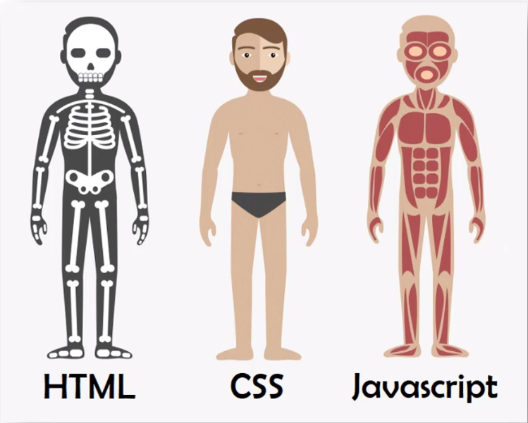

# 🖼️ Frontend

[`⬆️ inicio`](../Readme.md)

---

## Material de Estudo - Frontend

### 🖼️ HTML e CSS

+ [ ] [HTML](./HTML/Readme.md)
+ [ ] [CSS](./CSS/Readme.md)

### 🖼️ JS

+ [ ] [Javascript](./JS/Readme.md)
+ [ ] [Typescript](./JS/Readme.md)

#### Framework

+ [ ] [React](./JS/Readme.md)

---

## Analogia

---

[`^ topo`](#Frontend)

