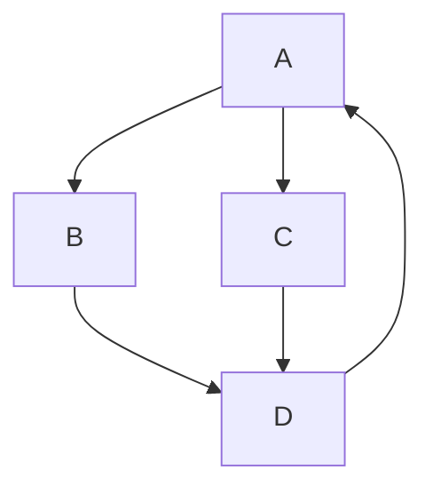
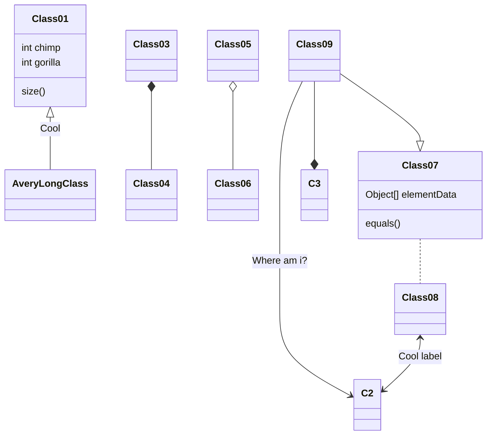
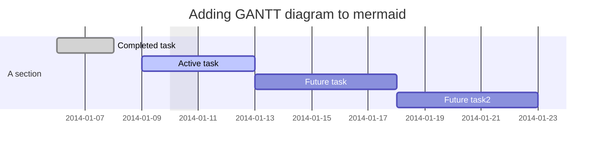
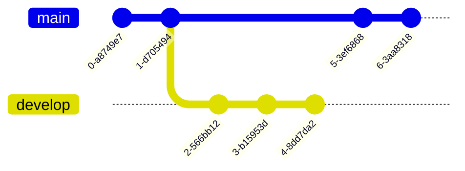
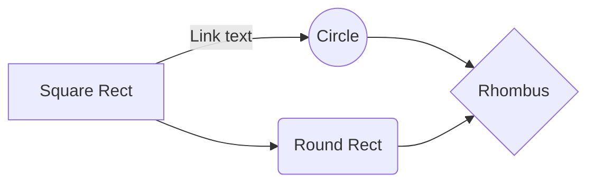
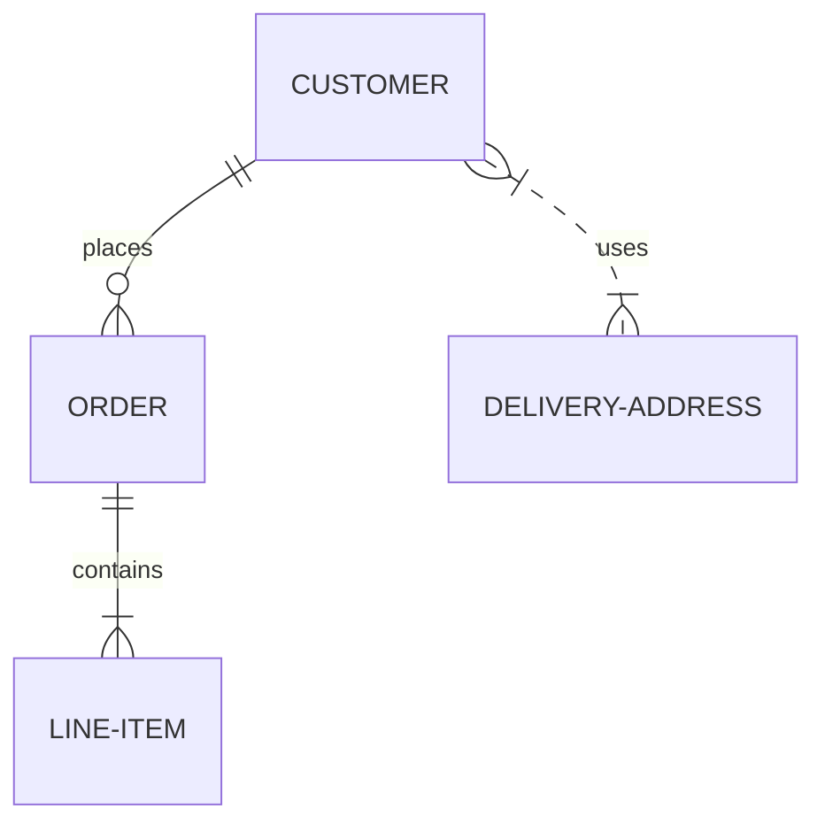
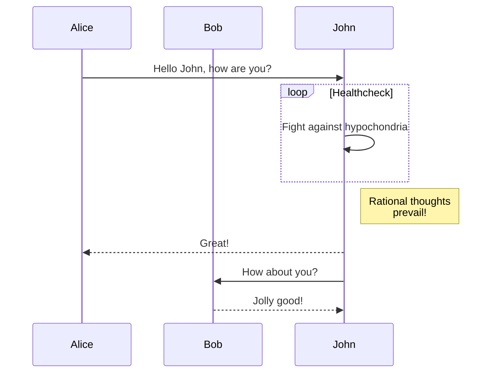
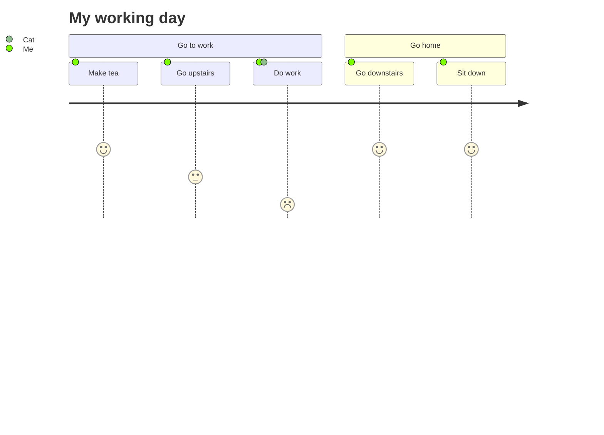
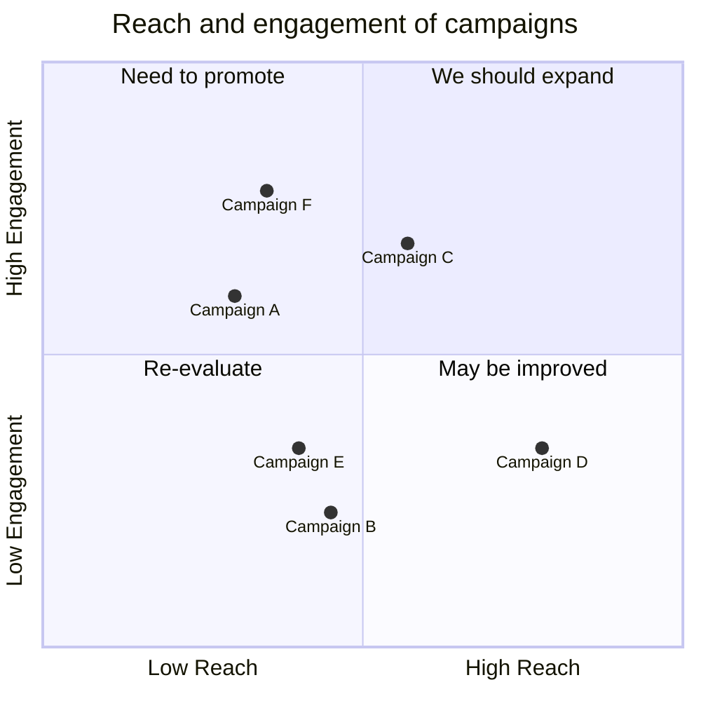
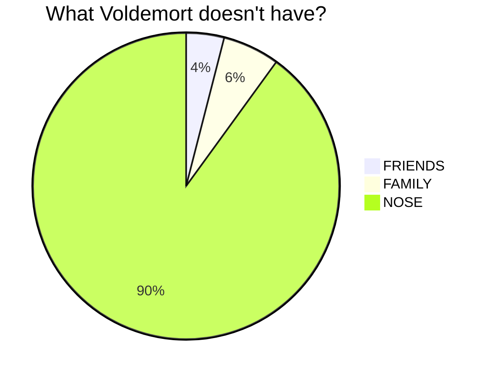

### <font color=0080ff>▪ Headers</font>

# Heading level 1
Heading level 1
===============

## Heading level 2
Heading level 2
---------------

### Heading level 3  {#custom-id}
#### Heading level 4
##### Heading level 5
###### Heading level 6

---

[Heading IDs]({#custom-id})

---

### <font color=0080ff>▪ Line break</font>

This is the first line.\<br><br>
And this is the second line with breakline.

---
### <font color=0080ff>▪ Text format</font>
>#### Bold
I just love **bold text**.<br> 
`I just love **bold text**.`

I just love __bold text__.<br>
`I just love __bold text__.`

Love**is**bold<br> 
`Love**is**bold`
<br><br>

>#### Italic
Italicized text is the *cat's meow*.<br>
`Italicized text is the *cat's meow*.`

Italicized text is the _cat's meow_.<br>
`Italicized text is the _cat's meow_.`

A*cat*meow<br>
`A*cat*meow`
<br><br>

>#### Bold and Italic
This text is ***really important***.<br>
`This text is ***really important***.`

This text is ___really important___.<br>
`This text is ___really important___.`

This text is __*really important*__.<br>
`This text is __*really important*__.`

>#### Tachado
~~The world is flat.~~ We now know that the world is round.<br>
`~~The world is flat.~~ We now know that the world is round.`

---
### <font color=0080ff>▪ Blockquotes (Citação)</font>

> Dorothy followed her through many of the beautiful rooms in her castle.

---
### <font color=0080ff>▪ Tasklists</font>
- [x] Write the press release
- [ ] Update the website
- [ ] Contact the media

---
### <font color=0080ff>▪ Listas</font>
>#### Ordenada
1. First item
8. Second item
3. Third item
    1. Indented item
    2. Indented item
5. Fourth item

```
1. First item
8. Second item
3. Third item
    1. Indented item 1
    2. Indented item 2
5. Fourth item
```
>#### Não ordenada
- First item
- Second item
- Third item
    - Indented item
    - Indented item
- Fourth item
+ Fifth item
* Sixth item
 
```
- First item
- Second item
- Third item
    - Indented item
    - Indented item
- Fourth item
+ Fifth item
* Sixth item
```

---
### <font color=0080ff>▪ Listas de Definição</font>
First Term 
: This is the definition of the first term.

Second Term
: This is one definition of the second term.
: This is another definition of the second term.

---
### <font color=0080ff>▪ Imagem</font>
<br>
``

>---
<br>
``

>---
[](https://www.google.com.br)<br>
`[](https://www.google.com.br)`


---
### <font color=0080ff>▪ Link</font>
Esse é um [link para o Google](https://www.google.com).<br>
`Esse é um [link para o Google](https://www.google.com).`

Esse é um [link para o **Google** com hint](https://www.google.com "Link para o Google").<br>
`Esse é um [link para o **Google** com hint](https://www.google.com "Link para o Google").`

<https://www.markdownguide.org><br>
<fake@example.com><br>
`<https://www.markdownguide.org>`<br>
`<fake@example.com>`

---
### <font color=0080ff>▪ Tabela</font>
| ID ↓² | Nome ↓¹ | Data Nascimento ↓³ | 
| ---: | :--- | :---: |
| 1 | Barry Allen | 01/01/1990 |
| 2 | Clark Kent | 01/02/1994 |
| 3 | Geraldo | 01/03/1996 |
| 4 | Matheus | 01/03/1996 |
| 5 | Washinton | 01/03/1996 |

```diff
| ID ↓² | Nome ↓¹ | Data Nascimento ↓³ | 
| ---: | :--- | :---: |
| 1 | Barry Allen | 01/01/1990 |
| 2 | Clark Kent | 01/02/1994 |
| 3 | Geraldo | 01/03/1996 |
| 4 | Matheus | 01/03/1996 |
| 5 | Washinton | 01/03/1996 |
```

---

```diff
- texto em vermelho
+ texto em verde
! texto em laranja
# texto em cinza
@@ texto em roxo (e negrito)@@
```

---

### <font color=0080ff>▪ Linguagens de Programação</font>

#### Delphi

```pascal
try
    qryTabela.DisableControls;
    qryTabela.First;
    while not qryTabela.Eof do
    begin
        {...
         codigo
         ...}

        qryTabela.Next;
    end;
finally
    qryTabela.EnableControls;
end;
```

---

#### JSON
```json
{
  "firstName": "John",
  "lastName": "Smith",
  "age": 25
}
```

---

#### HTML
```html
    <html>
        <div>
            <!-- Codigo -->
        </div>
    </html>
```

---

#### C#
```csharp
namespace ProEventos.API.Models
{
    public class Evento
    {
        public int EventoId { get; set; }
        public string Local { get; set; }
        public string DataEvento { get; set; }
        public string Tema { get; set; }
        public int QtdPessoas { get; set; }
        public string Lote { get; set; }
        public string ImagemURL { get; set; }
    }
}
```

---

#### Java
```java
@Entity
@Table(name = "tb_sellers")
public class Seller {	
	@Id
	@GeneratedValue(strategy = GenerationType.IDENTITY)	
	private Long id;
	private String name;
	
	@OneToMany(mappedBy = "seller")	
	private List<Sale> sales = new ArrayList<>();
	
	public Seller() {		
	}

	public Seller(Long id, String name) {
		this.id = id;
		this.name = name;
	}
}
```

---

#### XML
```xml
<datapacket version="2.0">
    <metadata>
        <fields>
            <field attrname="nitem" fieldtype="string" width="1"/>
            <field attrname="id" fieldtype="string" width="4"/>
            <field attrname="caption" fieldtype="string" width="26"/>
            <field attrname="caminho" fieldtype="string" width="8"/>
            <field attrname="silent" fieldtype="string" width="4"/>
            <field attrname="imgindex" fieldtype="string" width="1"/>
        </fields>
        <params/>
    </metadata>
    <rowdata/>
</datapacket>
```

#### CSV
```csv
TV LED,1290.99,1
Video Game Chair,350.50,3
Iphone X,900.00,2
Samsung Galaxy 9,850.00,2
```

---

### Fluxogramas

#### Mermaid

https://mermaid.js.org/syntax/examples.html



---



---



---



---



---



---



---



---



---



---

```sequence {theme="hand"}
Joao->Maria: Oi
Maria->Geraldo: Olá
Geraldo-->Joao: Oi também
```
