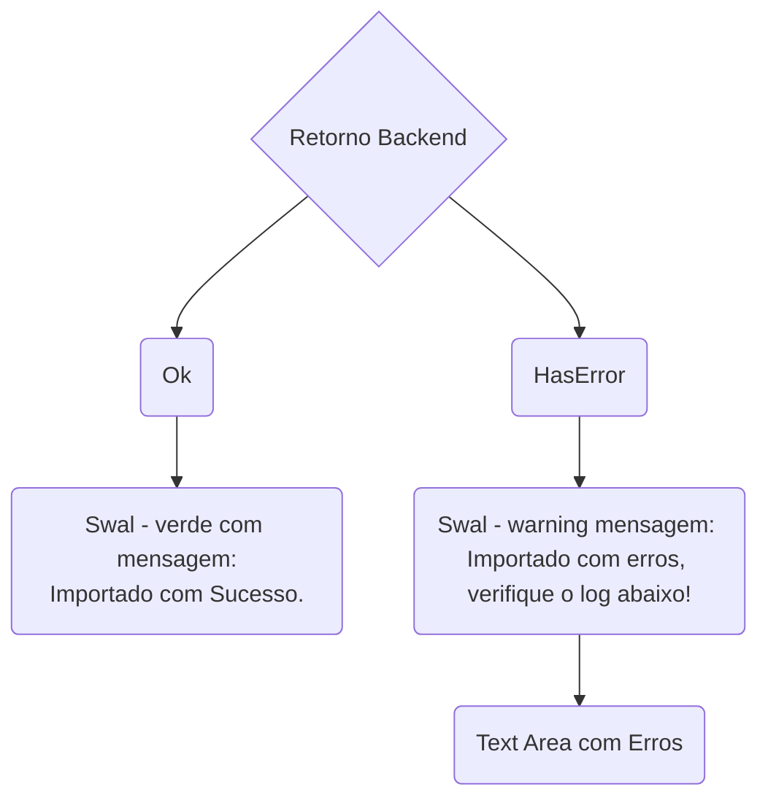

```mermaid
graph TD;
    Backend{Retorno Backend}-->Ok(Ok);
    Backend-->Erro(HasError);
    Ok-->SwalSuccess(Swal - verde com mensagem:\nImportado com Sucesso.);
    Erro-->SwalErro(Swal - warning mensagem: \nImportado com erros, verifique o log abaixo!);
    SwalErro-->TextArea(Text Area com Erros);
```
