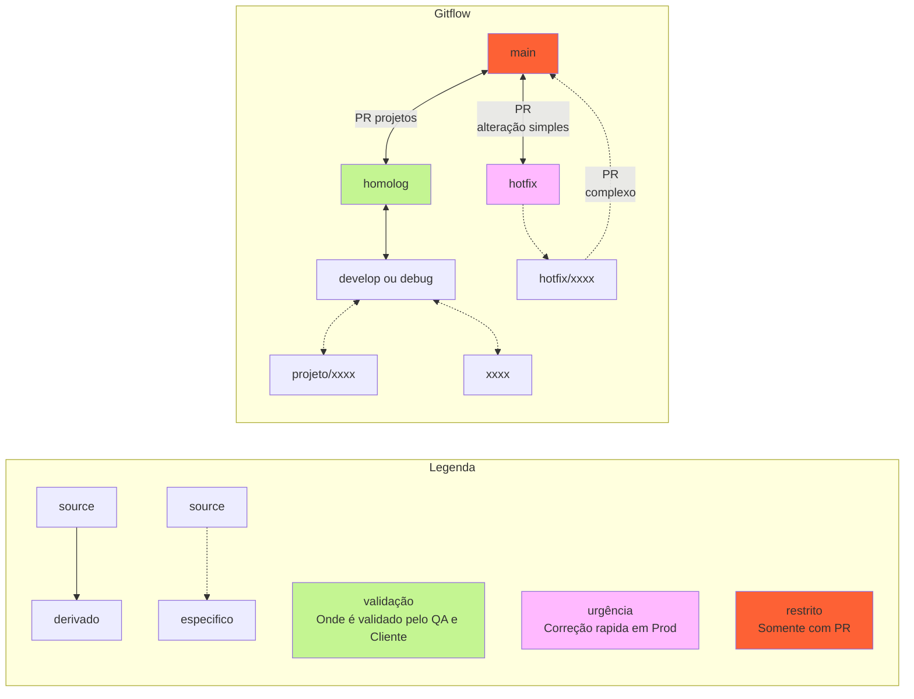

```mermaid
graph LR;

subgraph "Legenda"
    a1[source]-->a2[derivado]
    a3[source]-.->a4[especifico]
    a5[validação\nOnde é validado pelo QA e Cliente]:::validate
    a6[urgência\nCorreção rapida em Prod]:::urgencia
    a7[restrito\nSomente com PR]:::restrito
end

subgraph "Gitflow"
    main:::restrito<-->|PR projetos|homolog;
    main<-->|PR\nalteração simples|hotfix;
    homolog:::validate<-->develop[develop ou debug]
    develop<-.->projeto1[projeto/xxxx]
    develop<-.->especifico1[xxxx]
    hotfix:::urgencia-.->hotfix2[hotfix/xxxx]
    hotfix2[hotfix/xxxx]-.->|PR\ncomplexo|main

end

classDef restrito fill:#fd6135
classDef urgencia fill:#ffb9ff
classDef validate fill:#c4f592

```
