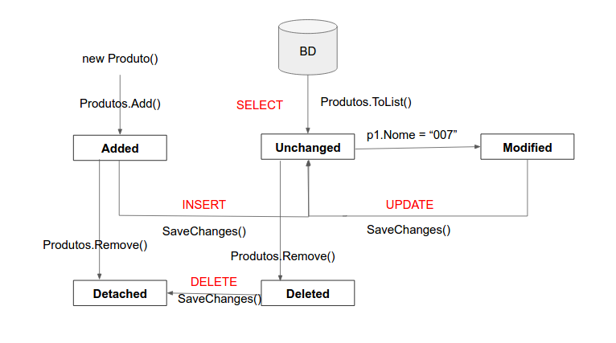

# Markdown

[Documentação Microsoft](https://docs.microsoft.com/pt-br/contribute/markdown-reference)

---

## Seções recolhiveis

<details><summary>Seção</summary>
<p>

#### We can hide anything, even code!

```ruby
puts "Hello World"
```

</details>

<details>

### Ruby

```ruby
puts "Hello World"
```

</details>

---

## Apóstrofes e aspas

Se você copiar do Word para um editor de Markdown, o texto poderá conter apóstrofes ou aspas "inteligentes" (inglesas). Eles precisam ser codificados ou alterados para apóstrofos ou aspas simples. Caso contrário, quando o arquivo for publicado poderão ocorrer erros como: It’s

Estas são as codificações para as versões "inteligentes" dessas marcas de pontuação:

Aspas à esquerda (de abertura): &#8220;
Aspas à direita (de fechamento): &#8221;
Aspas simples à direita (de fechamento) ou apóstrofe: &#8217;
Aspas simples à esquerda (de abertura) (raramente usadas): &#8216;

---

## Colchetes angulares `<>`
Se você usar colchetes angulares no texto no arquivo (por exemplo, para indicar um espaço reservado), será necessário codificar manualmente os colchetes angulares. Caso contrário, o Markdown entenderá que eles são uma marca HTML.

Por exemplo, codifique `<script name>` como `&lt;script name&gt;` ou `\<script name>`.

Os colchetes angulares não precisam ter escape no texto formatado como código embutido ou em blocos de código.

---

### Comentários
Exemplo no código:
<!--- Here's my comment --->
`<!--- Here's my comment --->`

---

### Imagens

Examplo:


---

### Navegação

[`< navegar página`](./Exemplo.md)
[`< navegar página em outra pasta`](../Readme.md)
[`^ seções recolhiveis`](#seções-recolhiveis)
[`^ topo`](#-markdown)